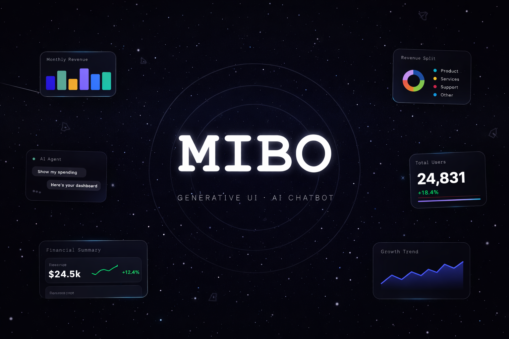
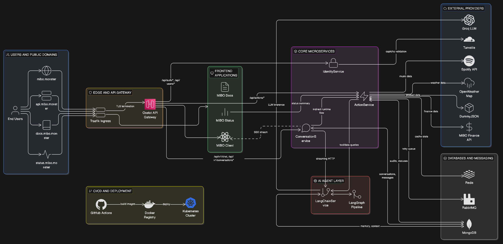

# MIBO

<p align="center">
  <a href="https://github.com/bogdanboicu23/MIBO/actions/workflows/tests.yml">
    
  </a>
  <a href="https://github.com/bogdanboicu23/MIBO/stargazers">
    
  </a>
  <a href="https://github.com/bogdanboicu23/MIBO/commits/main">
    
  </a>
</p>

<p align="center">
  
  
  
  
  
  
  
  
  
  
  
  
  
  
  
  
  
  
  
  
  
</p>

<p align="center">
  
</p>

MIBO stands for Minimal Input, Beautiful Output. It is an AI chatbot that answers prompts with generative UI connected to external services, built on top of a React client, a .NET backend, and a Python AI runtime.

## Architecture Overview

<p align="center">
  
</p>

<p align="center">
  High-level runtime architecture of the current MIBO platform, including the client, gateway, backend services, AI agent, active data stores, and external integrations.
</p>

## Live Surfaces

| Surface | URL |
| --- | --- |
| Main app | `https://mibo.monster` |
| Docs | `https://docs.mibo.monster` |
| Status page | `https://status.mibo.monster` |
| API gateway | `https://api.mibo.monster` |
| Grafana | `https://grafana.mibo.monster/` |
| Traefik dashboard | `https://traefik.mibo.monster/` |

## What The Platform Includes

- `MIBO.ApiGateway` as the public entry point using Ocelot.
- `MIBO.IdentityService` for authentication, JWT, refresh-token cookies, and Spotify OAuth.
- `MIBO.ConversationService` for chat endpoints, SSE streaming relay, and Mongo-backed conversation history.
- `MIBO.ActionService` for structured query and execute contracts used by the agent and UI.
- `MIBO.LangChainService` for the AI pipeline built with FastAPI, LangGraph, and Groq.
- `MIBO.Client/client` as the main React application.
- `MIBO.Client/docs` as the documentation site.
- `MIBO.Client/status` as the operational status dashboard.
- `MIBO.AppHost` as the recommended local orchestrator using .NET Aspire.

## Core Capabilities

- Authenticated conversational UI with persistent history.
- SSE-based streaming from the AI pipeline to the client.
- Structured generative UI payloads.
- External integrations for weather, products, finance, news, and Spotify.
- Retry handling with Polly, RabbitMQ delayed retry, and dead-letter queue support.
- Groq API key rotation with round-robin failover.
- Monitoring and audit snapshots for external-service health.

## Tech Stack

- Backend: .NET 9, ASP.NET Core, Ocelot, ASP.NET Identity
- AI runtime: Python 3.11, FastAPI, LangGraph, Groq
- Frontend: React, TypeScript, Vite
- Data and messaging: MongoDB, PostgreSQL, Redis, RabbitMQ
- Local orchestration: Docker, .NET Aspire
- Deployment: Kubernetes, Helm, Traefik
- Observability: Grafana, Loki, OpenTelemetry
- Delivery: GitHub Actions

## Quick Start

### Prerequisites

- .NET 9 SDK
- Node.js 20+
- Docker
- Python 3.11+ if you want to run `MIBO.LangChainService` outside Docker

### Recommended Local Startup

AppHost is the source of truth for the local topology and starts the full platform stack.

```bash
export GROQ_API_KEY=your_key_here
cd src/MIBO.AppHost
dotnet run
```

This provisions:

- Redis
- MongoDB
- PostgreSQL
- RabbitMQ
- ActionService
- LangChainService
- ConversationService
- IdentityService
- API Gateway
- Client
- Docs
- Status

### Manual Startup

Use this only when working on isolated parts of the platform.

```bash
cd src
dotnet run --project MIBO.IdentityService
dotnet run --project MIBO.ActionService
dotnet run --project MIBO.ConversationService
dotnet run --project MIBO.ApiGateway
```

```bash
cd src/MIBO.LangChainService
python -m venv .venv
source .venv/bin/activate
pip install -r requirements.txt
python -m uvicorn main:app --host 0.0.0.0 --port 8088 --proxy-headers
```

## Repository Layout

```text
MIBO/
├── src/                  # Services, frontends, shared libraries, AppHost
├── tests/                # Unit, integration, and end-to-end tests
├── deploy/               # Helm charts, environment values, migration jobs
├── k8s/                  # Kubernetes manifests for apps and platform resources
└── .github/workflows/    # CI/CD pipelines
```

Key areas inside `src/`:

- `src/MIBO.AppHost`
- `src/MIBO.ApiGateway`
- `src/MIBO.IdentityService`
- `src/MIBO.ConversationService`
- `src/MIBO.ActionService`
- `src/MIBO.LangChainService`
- `src/MIBO.Client/client`
- `src/MIBO.Client/docs`
- `src/MIBO.Client/status`

## Testing

```bash
dotnet test tests/MIBO.Tests.sln
```

```bash
cd src/MIBO.Client/docs
npm install
npm run build
```

## Deployment

- Backend services are deployed with Helm charts from `deploy/helm`.
- Frontend apps are deployed with Kubernetes manifests from `k8s/apps`.
- CI/CD pipelines live in `.github/workflows`.
- Test-environment values live under `deploy/environments/test`.

## Documentation

The technical documentation lives in `src/MIBO.Client/docs` and is the best place for runtime architecture, API reference, deployment, and testing details.

Useful starting points:

- Platform overview: `src/MIBO.Client/docs/src/content/getting-started/index.mdx`
- Installation: `src/MIBO.Client/docs/src/content/getting-started/installation.mdx`
- Architecture: `src/MIBO.Client/docs/src/content/architecture`
- API reference: `src/MIBO.Client/docs/src/content/api-reference`
