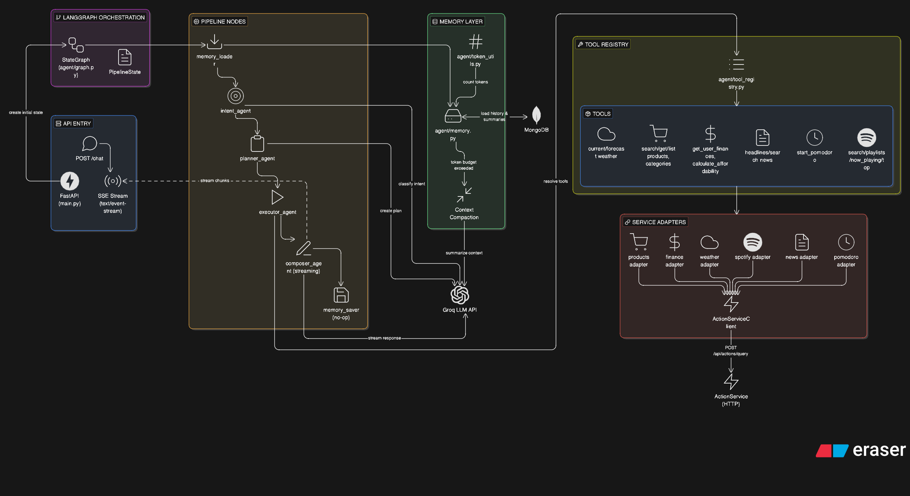

# MIBO

MIBO este o platforma AI assistant construita ca un sistem service-oriented, cu backend .NET, agent AI Python, frontend React si un runtime de generative UI bazat pe raspunsuri structurate, nu doar pe text simplu. Repository-ul reuneste experienta de chat, autentificarea, persistenta conversatiilor, orchestration-ul AI, integrarea cu servicii externe, documentatia tehnica si dashboard-ul de status.

## Public Web Addresses

| Surface | URL | Purpose |
| --- | --- | --- |
| Main product | [https://mibo.monster](https://mibo.monster) | aplicatia principala pentru utilizatorii finali |
| Alternate main host | [https://www.mibo.monster](https://www.mibo.monster) | host public alternativ pentru client |
| Public API | [https://api.mibo.monster](https://api.mibo.monster) | gateway-ul public pentru auth, chat, conversations si actions |
| Documentation | [https://docs.mibo.monster](https://docs.mibo.monster) | documentatia tehnica si de produs |
| Status page | [https://status.mibo.monster](https://status.mibo.monster) | dashboard-ul operational pentru health, audit si incidente |

## Technology Landscape

| Area | Main technologies |
| --- | --- |
| Backend platform | .NET 9, ASP.NET Core, Ocelot, ASP.NET Identity, EF Core, Polly |
| AI runtime | Python 3.11, FastAPI, LangChain, LangGraph, `langchain-groq`, Motor |
| Frontend | React 19, TypeScript, Vite, Tailwind CSS |
| Persistence | MongoDB, PostgreSQL, Redis |
| Messaging / retry | RabbitMQ |
| External providers | Groq, Spotify Web API, OpenWeatherMap, NewsAPI, DummyJSON, BankService |

## Platform Architecture


MIBO este impartit in limite arhitecturale clare:

1. `MIBO.ApiGateway` este entry point-ul public pentru trafic HTTP autentificat.
2. `MIBO.IdentityService` gestioneaza identitatea, JWT-urile, refresh token-urile, Spotify OAuth si starea conexiunii financiare.
3. `MIBO.ConversationService` detine conversatiile, persistenta mesajelor, SSE relay-ul si synthetic monitoring pentru platforma si agentul AI.
4. `MIBO.LangChainService` este nucleul AI, responsabil de reasoning, planning, tool orchestration si compunerea raspunsului final.
5. `MIBO.ActionService` este stratul comun pentru query/execute catre integrari externe si pentru refresh-ul live al componentelor UI.
6. `MIBO.Client/client` transforma raspunsul AI in `ui.v1` si ruleaza componente interactive in browser.

### End-to-end runtime flow

1. Utilizatorul interactioneaza cu clientul React.
2. Clientul trimite request-ul catre `MIBO.ApiGateway`.
3. Gateway-ul valideaza JWT-ul si propaga identitatea prin `X-User-Id` si `X-User-Email`.
4. `MIBO.ConversationService` valideaza promptul, rezolva sau creeaza conversatia si persista mesajul utilizatorului in MongoDB.
5. `MIBO.ConversationService` deschide un SSE upstream catre `MIBO.LangChainService`.
6. `MIBO.LangChainService` incarca memoria, clasifica intentia, planifica executia, apeleaza tool-uri prin `MIBO.ActionService` si compune raspunsul final.
7. `MIBO.LangChainService` trimite SSE events de tip `session`, `status`, `chunk` si `done`.
8. `MIBO.ConversationService` face relay la stream catre browser si persista `assistantPayload` cand primeste `done`.
9. Clientul construieste `ui.v1` din payload-ul AI si ruleaza componentele interactive.
10. Actiunile ulterioare si refresh-urile de date folosesc tot `MIBO.ActionService`, pastrand acelasi contract intre AI si UI.

### Core architectural decisions

- Clientul nu vorbeste direct cu agentul Python; boundary-ul public de chat este `ConversationService`.
- Agentul AI nu acceseaza direct majoritatea providerilor externi; foloseste `ActionService` ca strat comun de integrare.
- Conversatiile si mesajele sunt persistate de `ConversationService`; agentul AI doar citeste contextul si actualizeaza metadatele de sumarizare.
- Output-ul AI este JSON structurat pentru generative UI, nu HTML generat arbitrar.
- Transportul principal pentru chat este HTTP plus Server-Sent Events.

## AI Agent Architecture



`MIBO.LangChainService` este componenta cu cea mai mare densitate arhitecturala din platforma. Serviciul expune un singur endpoint, `POST /chat`, si ruleaza un pipeline LangGraph liniar, determinist, pe baza unui `PipelineState` comun.

### AI pipeline

1. `memory_loader` incarca istoricul conversatiei si sumarul curent din MongoDB.
2. `intent_agent` clasifica cererea si decide daca este nevoie de date externe, UI sau calcul.
3. `planner_agent` construieste un `ExecutionPlan` cu `tool_calls`, `data_sources`, `actions`, `components_plan` si instructiuni de raspuns.
4. `executor_agent` rezolva tool-urile din `TOOL_REGISTRY` si colecteaza rezultatele.
5. `composer_agent` foloseste LLM-ul in mod streaming pentru a produce raspunsul final.
6. `memory_saver` este un terminal node lightweight; persistenta mesajelor ramane in responsabilitatea `ConversationService`.

### AI runtime characteristics

- FastAPI foloseste `StreamingResponse` cu `text/event-stream`.
- `composer_agent` este singurul node LLM cu streaming activ.
- `intent_agent`, `planner_agent`, `composer_agent` si sumarizarea contextului folosesc `ChatGroq`.
- Modelul configurat direct in cod este `llama-3.3-70b-versatile`.
- Contextul este limitat prin `token_utils.py`; cand istoricul creste prea mult, `memory.py` compacteaza mesajele vechi intr-un summary.
- `models/schemas.py` defineste contractele `ChatRequest`, `IntentResult`, `ExecutionPlan`, `FinalResponse`, `DataSourceSpec`, `ActionSpec` si `ComponentSpec`.

### Final response contract

```json
{
  "text": "assistant answer",
  "components": [],
  "data_sources": [],
  "actions": [],
  "subscriptions": []
}
```

Acest contract este important pentru tot proiectul:

- `text` reprezinta raspunsul conversational principal.
- `components` descriu UI-ul initial de randat.
- `data_sources` definesc surse live reutilizabile.
- `actions` definesc interactiuni executabile din frontend.
- `subscriptions` pregatesc extensii realtime sau live-refresh.

### Tool domains exposed by the AI agent

Tool registry-ul din `MIBO.LangChainService` include:

- products: `search_products`, `get_product`, `list_products`, `get_categories`
- finance: `get_user_finances`, `calculate_affordability`
- weather: `get_current_weather`, `get_weather_forecast`
- pomodoro: `start_pomodoro`
- spotify: `spotify_search`, `spotify_now_playing`, `spotify_playlists`, `spotify_top_tracks`, `spotify_top_artists`
- news: `get_headlines`, `search_news`

In practica, majoritatea acestor tool-uri sunt wrapper-e subtiri peste `MIBO.ActionService`.

## Service Catalog

| Service / project | Stack | Main responsibilities |
| --- | --- | --- |
| `MIBO.ApiGateway` | ASP.NET Core, Ocelot | rute publice, validare JWT, CORS, propagare claims in headers |
| `MIBO.IdentityService` | ASP.NET Core, ASP.NET Identity, EF Core, PostgreSQL, Redis | login, register, refresh, `me`, Spotify OAuth, finance connection state |
| `MIBO.ConversationService` | ASP.NET Core, MongoDB | CRUD conversatii, endpoint-ul public de chat, persistenta user/assistant messages, SSE relay, synthetic monitoring |
| `MIBO.LangChainService` | FastAPI, LangChain, LangGraph, Groq, MongoDB | intent detection, planning, tool orchestration, context compaction, final JSON composition |
| `MIBO.ActionService` | ASP.NET Core, Polly, MongoDB, Redis, RabbitMQ | `query` / `execute`, handler routing, transforms, field hints, monitoring, retry orchestration |
| `MIBO.AppHost` | .NET Aspire | orchestration pentru mediile de dezvoltare si wiring intre servicii |
| `MIBO.Storage.Mongo` | shared .NET library | bootstrap Mongo, index management, conversation store, UI store, monitoring store |
| `MIBO.Cache.Redis` | shared .NET library | Spotify token store, finance connection store, optional tool cache |
| `MIBO.Storage.PostgreSQL` | shared .NET library | proiect relational minim; runtime-ul relational activ este concentrat in `IdentityService` |

## Frontend Applications

| Application | Location | Role in architecture |
| --- | --- | --- |
| Main client | `src/MIBO.Client/client` | experienta principala de chat, autentificare, consum SSE, generative UI runtime |
| Docs | `src/MIBO.Client/docs` | documentatia tehnica si de produs, scrisa in MDX |
| Status | `src/MIBO.Client/status` | health dashboard pentru platforma si integrari externe |

### Main client runtime

Clientul React nu randaza direct output-ul brut al modelului. El:

1. incarca conversatii si mesaje prin gateway
2. deschide `POST /api/v1/chat`
3. parseaza manual stream-ul SSE
4. finalizeaza mesajul assistant la evenimentul `done`
5. construieste `ui.v1` prin `buildUiFromAgentResponse()`
6. tine registre locale pentru `data_sources` si `actions`
7. executa refresh-uri si actiuni ulterioare prin `ActionService`

Registry-ul de componente din sandbox acopera cazuri precum:

- markdown si rich text
- tables si summary panels
- charts
- product cards si product grids
- search, sort, filter si pagination controls
- action panels
- pomodoro timer
- Spotify widgets

## Data Ownership and Persistence

| Technology | Owner(s) | What is stored |
| --- | --- | --- |
| MongoDB | `ConversationService`, `LangChainService`, `ActionService` monitoring | `conversations`, `messages`, `ui_instances`, `external_service_audits`, `external_service_statuses` |
| PostgreSQL | `IdentityService` | users, roles, auth-related relational data |
| Redis | `IdentityService`, `ActionService` | Spotify tokens, finance connection flags, cache-like operational state |
| RabbitMQ | `ActionService` | delayed retries si dead-letter flow pentru integrari migrate pe retry queue |

### Important storage boundaries

- `ConversationService` este source of truth pentru conversatii si mesaje.
- `LangChainService` citeste contextul din aceleasi colectii Mongo si mentine metadatele de summary.
- `assistantPayload` este persistat in Mongo, iar `ui.v1` este derivat in client.
- `ActionService` foloseste Mongo pentru audit si status snapshots ale integrarii externe.

## External Integrations and Business Domains

| Domain | Integration path | Current purpose |
| --- | --- | --- |
| Products | `DummyJSON` via `ActionService` | catalog, categorii, detalii produs |
| Weather | `OpenWeatherMap` via `ActionService` | vreme curenta si forecast |
| Finance | `BankService` / MIBO Finance via `ActionService` | conturi, tranzactii, bugete, rezumate si analytics |
| Spotify | Spotify Web API via `IdentityService` + `ActionService` | connect OAuth, search, now playing, playlists, top tracks, top artists |
| News | `NewsAPI` via `ActionService` | headlines si cautare articole |
| Productivity | handler local Pomodoro | configuratie si runtime pentru timer |
| LLM | Groq | inferenta pentru intent, planning, composition si context compaction |

## Communication Model

### Public API surface

Gateway-ul expune in mod activ:

- `/api/auth/*`
- `/api/users/*`
- `/api/v1/chat`
- `/api/v1/conversations`
- `/api/v1/conversations/{conversationId}`
- `/api/actions/*`
- `/api/actions/status/*`

### SSE protocol

Chat-ul foloseste evenimente SSE standard:

- `session` pentru identificatorul conversatiei
- `status` pentru progresul intern al pipeline-ului AI
- `chunk` pentru fragmentele partiale ale raspunsului final
- `done` pentru payload-ul final complet

Aceasta separare permite UX progresiv si, in acelasi timp, pastreaza un contract final determinist pentru persistenta si randare.

## Action Runtime

`MIBO.ActionService` este o componenta cheie deoarece unifica doua nevoi aparent diferite:

- tool calls venite din agentul AI
- interactiuni ulterioare declansate din frontend

Serviciul expune:

- `POST /api/actions/query`
- `POST /api/actions/execute`
- `GET /api/actions/status/summary`

Din punct de vedere arhitectural, `ActionService` ofera:

- handler-based routing pentru integrari
- field hint inference pentru componente UI
- transform-uri precum `project_rows`
- injectarea `user_id` in request-urile autentificate
- retry local cu Polly
- retry queue si audit trail pentru integrari externe

## Observability and Resilience

- `ConversationService` inregistreaza synthetic monitoring pentru `platform` si `ai-agent`.
- `ActionService` persista audit history si latest status per external service.
- `MIBO.Client/status` consuma sumarul de status si vizualizeaza health, outages, retries si audit events.
- RabbitMQ este folosit pentru delayed retries si dead-letter flow in zona integratiilor externe.
- Pipeline-ul AI aplica token budgeting si JSON recovery pentru a reduce failure-urile la compunerea raspunsului.

## Repository Structure

```text
src/
  MIBO.ApiGateway/
  MIBO.IdentityService/
  MIBO.ConversationService/
  MIBO.ActionService/
  MIBO.LangChainService/
  MIBO.Storage.Mongo/
  MIBO.Cache.Redis/
  MIBO.Storage.PostgreSQL/
  MIBO.AppHost/
  MIBO.Client/
    client/
    docs/
    status/

tests/
  MIBO.Tests.sln
  MIBO.ActionService.Tests/
  MIBO.ApiGateway.Tests/
  MIBO.ConversationService.Tests/
  MIBO.IdentityService.Tests/
  MIBO.LangChainService.Tests/
  MIBO.Storage.Mongo.Tests/
  MIBO.IntegrationTests/
  MIBO.E2ETests/
  TESTING-GUIDE.md
```

## Testing and Documentation Assets

- [tests/MIBO.Tests.sln](tests/MIBO.Tests.sln) centralizeaza proiectele de test pentru backend, AI agent, storage, integration si E2E.
- [tests/TESTING-GUIDE.md](tests/TESTING-GUIDE.md) documenteaza strategia dorita de testare pe modelul unit / integration / E2E.
- Repository-ul contine deja structura completa de testare, dar o parte din suite sunt inca scaffold-uri si trebuie extinse incremental.
- Documentatia tehnica a platformei este scrisa in [src/MIBO.Client/docs/src/content/](src/MIBO.Client/docs/src/content/).
- Zonele principale de documentatie sunt:
  - [src/MIBO.Client/docs/src/content/architecture/](src/MIBO.Client/docs/src/content/architecture/)
  - [src/MIBO.Client/docs/src/content/chat-system/](src/MIBO.Client/docs/src/content/chat-system/)
  - [src/MIBO.Client/docs/src/content/api-reference/](src/MIBO.Client/docs/src/content/api-reference/)

## Architectural Summary

MIBO nu este un simplu chatbot. Este o platforma AI compusa dintr-un gateway securizat, servicii backend specializate, un agent LangGraph cu memorie si tool orchestration, un action layer comun pentru date si integrari, si un frontend capabil sa materializeze raspunsurile AI in UI interactiv. Cea mai importanta idee a proiectului este separarea responsabilitatilor:

- `ConversationService` detine lifecycle-ul conversatiei si persistenta
- `LangChainService` detine reasoning-ul AI
- `ActionService` detine integrarea si executia de date
- clientul detine randarea finala si interactiunea utilizatorului

Aceasta impartire face sistemul mai usor de extins, de monitorizat si de evoluat pe verticalele de business existente: finance, products, weather, news, Spotify si productivity tooling.
